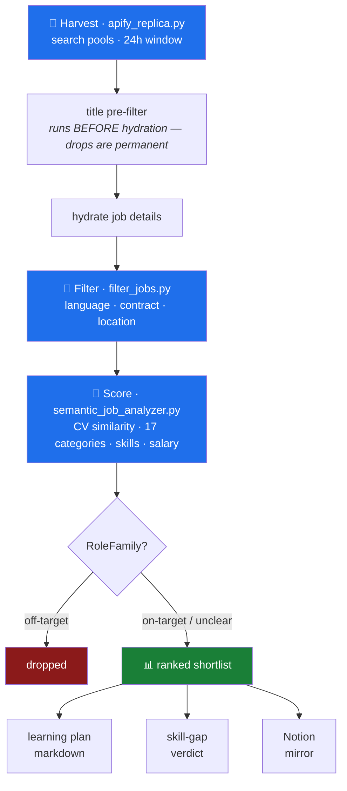

# job-market-radar

A local-first ETL + analytics pipeline that measures **what engineering job ads actually require**, as opposed to what they merely mention.

It scrapes a day's postings from LinkedIn's public guest API, filters them down to a target population, scores each against a CV using local models, and renders a market report. No job description ever leaves the machine.

The interesting part is not the scraping. It's that **a skill appearing in a job ad tells you almost nothing on its own**:

| Skill | Mentioned in | Actually required in |
|---|---:|---:|
| Kubernetes | 39.7% | **20.2%** |
| Cloud (AWS/Azure/GCP) | 48.1% | **20.0%** |
| CI/CD | 45.2% | **12.4%** |
| Terraform | 29.1% | **11.9%** |
| Go | 21.8% | **8.7%** |

*Population: 887 postings classified into the platform/SRE/DevOps/cloud track, Germany, English-language, full-time, over ~4 weeks.*

A tag increments identically for *"Proficient in Go and Python is a MUST"* and *"Programming: Bash/Python/Go"*. The first is a gate. The second is a list. Conflating them is how you end up studying the wrong thing — so this pipeline classifies **modality** (required / alternative / optional) per mention, scoped to the sentence or bullet the skill appears in.

---

## Pipeline



**A typical night:** 591 raw postings → 199 survive filtering → 134 scored → **14 above the shortlist threshold**. Roughly two thirds are dropped for a hard German-language requirement or an out-of-scope location; a further ~40% of survivors are rejected as the wrong engineering discipline.

## Layout

```
main.py                      # orchestrator
config.example.json          # copy to config.json — CV URL, keywords, geos, caps

src/scraper/
  apify_replica.py           # ① harvest IDs → hydrate details
  filter_jobs.py             # ② language / contract / location
  semantic_job_analyzer.py   # ③ CV scoring, categories, RoleFamily, salary
  user_config.py             # config.json → env var → default

jobs_analytics/
  update_learning_plan.py    # rewrites the marked plan sections
  skill_gap_report.py        # read-only weekly verdict, no models
  publish_to_notion.py       # markdown → Notion blocks
  backfill_role_family.py    # re-classify the corpus without reloading models
  market_insights.py         # all-time aggregate

tests/                       # 294 tests
.agents/AGENTS.md            # engineering rules, anti-patterns, regex traps
```

Run it end to end:

```bash
uv run python main.py
```

Or a stage at a time:

```bash
uv run python -m scraper.apify_replica
uv run python -m scraper.filter_jobs jobs_output/jobs_24h_<stamp>.json
uv run python -m scraper.semantic_job_analyzer jobs_output/jobs_24h_<stamp>_filtered.json
uv run python jobs_analytics/skill_gap_report.py
```

### 1. Harvest — `src/scraper/apify_replica.py`

Two phases against the guest API: ID harvest, then detail hydration.

- **Search pools are config-driven** — keyword groups × geo targets, declared in `config.json`. Each pool is a
  single `geoId`; comma-encoded multi-geo params make LinkedIn silently fall back to a global result set.
- **`skip_geos` lets one keyword group drop a geo another keeps.** Pools whose results are already claimed by an
  earlier pool cost requests and yield nothing, and every extra pool widens the soft-block window for the whole run.
- **Queries are deliberately unquoted.** Exact-match quoting drops compound titles like `Senior Platform Engineer (Kubernetes)`, and `NOT` clauses crash the endpoint. Recall is maximised here and precision is paid for downstream.
- **Soft-block detection.** LinkedIn's dominant defence is not a 429 — it's an HTTP 200 replaying a cached page to a flagged IP. The scraper distinguishes that from genuine end-of-stream and aborts loudly rather than silently degrading every later pool.
- **Title pre-filter** runs before hydration and logs every skip with the exact word that fired it. Anything dropped here is invisible to all later stages, so it is the one filter that logs exhaustively.

### 2. Filter — `src/scraper/filter_jobs.py`

Four independent drops: language detection, explicit German-language requirements, contract/part-time/internship, and location targeting.

The German check scores **per bullet or sentence**, never document-wide. Document-wide scoring means a single *"German is a plus"* anywhere cancels a hard C1 requirement stated in another bullet — that alone was leaking 13–17% of every run.

### 3. Score — `src/scraper/semantic_job_analyzer.py`

- **Embeddings:** `BAAI/bge-small-en-v1.5` (512-token context; a 256-token model silently truncates most descriptions).
- **CPU by default**, including on Apple Silicon. Benchmarked: MPS was ~2.3× *slower* for this dispatch-bound workload and pegged the GPU. Override with `SEMANTIC_DEVICE`.
- **`FitScore`** = 0.7 × normalised semantic similarity + 0.3 × CV skill overlap. Cosine similarity alone rewards vocabulary overlap, which ranks a backend role above a platform role when both talk about the same tools.
- **`RoleFamily`** (`on-target` / `unclear` / `off-target`) is a dedicated **reject** signal. It exists because the category classifier is forced-choice nearest-centroid over 17 labels with no "none of the above" — an FPGA engineer or an account executive has no correct label, so it must land somewhere, and narrowing a definition only relocates the junk to the next-nearest centroid.

### 4. Report — `jobs_analytics/`

- `update_learning_plan.py` — rewrites marked sections of a markdown plan: demand per track and category, required-vs-mentioned splits, salary bands, seniority lift tables.
- `skill_gap_report.py` — read-only, no models, runs in seconds. Prints a verdict block.
- `publish_to_notion.py` — mirrors the markdown into Notion with a hand-rolled md→blocks converter.
- `backfill_role_family.py` — re-applies classification across the whole corpus without reloading models.

---

## Setup

```bash
git clone https://github.com/YOUR_GH_USER/job-market-radar
cd job-market-radar
uv sync
cp config.example.json config.json     # then edit it
uv run pytest -v
```

`config.json` is gitignored and holds everything personal: CV URL, Notion page id, plan path, search keywords and geos. Every value also has a `JOBS_*` environment override. See `config.example.json` for the full shape.

For the nightly run, `scheduler.example.plist` is a launchd template — replace the `{{REPO_PATH}}`, `{{HOME}}` and `{{LABEL}}` placeholders.

**Requires** Python 3.11+, [`uv`](https://docs.astral.sh/uv/), and ~500MB for the models on first run. Notion publishing additionally needs `NOTION_API_KEY` in the environment or a repo-root `.env`.

---

## Statistical notes

Reporting decisions here were shaped by getting them wrong first:

- **Every percentage ships with its denominator.** Three incompatible ones were once in circulation, making the same skill read as 15%, 20% or 30% depending on which table you were looking at.
- **A skill's absence from a ranked table is not 0%.** Tools sitting below a top-N cut were recorded as measured zeros. The report now renders an exhaustive audit of every tracked skill with its raw `n`.
- **Differentiators are reported as lift, never raw prevalence.** Boilerplate makes almost every theme look required — "security appears in 47% of Staff ads" is meaningless when non-Staff ads mention it at 50%. Tables render focus% / baseline% / Δpp with a two-proportion z-test.
- **Category membership alone is not a population.** Of postings landing in the four target categories, 58% had no infrastructure term in the title. Percentages computed on the raw category set run roughly 2× diluted.

## Testing

```bash
uv run pytest -v     # 288 tests
```

Filter and classifier changes are regression-tested in **both** directions — what a rule must catch and what it must not. Several rules in here were built, measured, and removed for rejecting genuine matches; the tests are what keep them from being re-added.

## Licence

MIT
